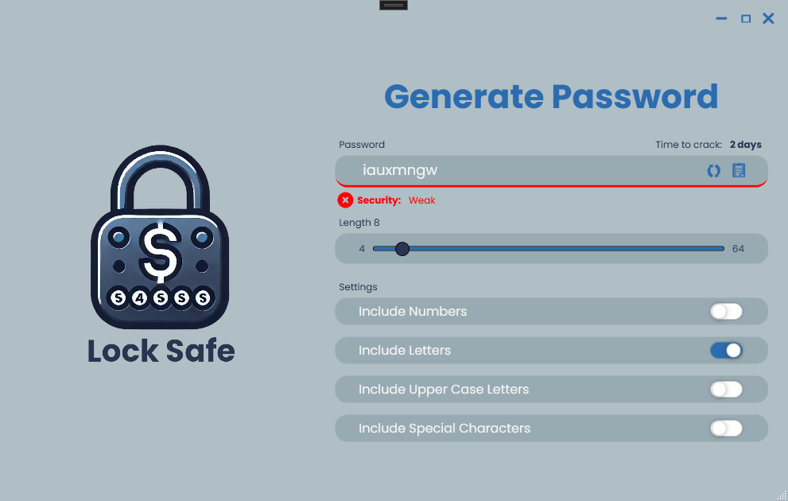
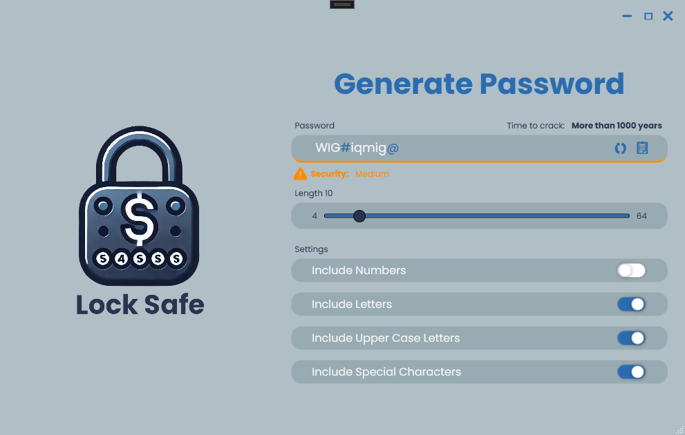
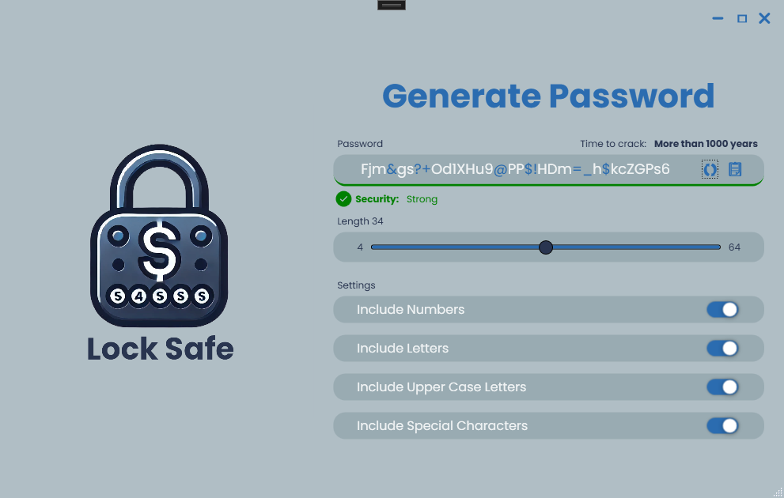
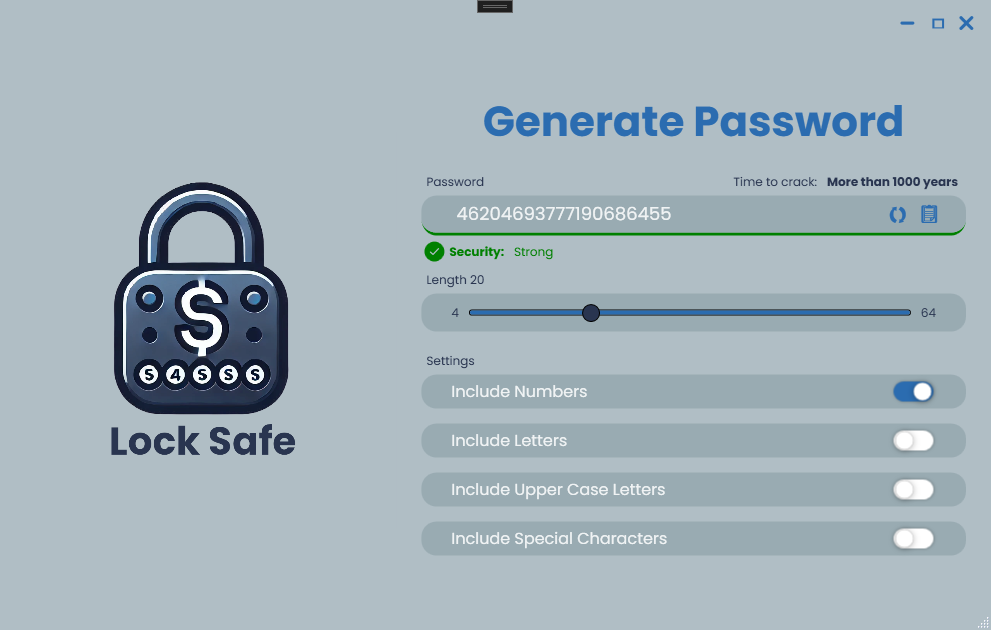

# Lock Safe

## Übersicht

**Lock Safe** ist ein einfacher und sicherer Passwort-Generator, der mit einer benutzerfreundlichen Oberfläche in C# WPF entwickelt wurde. Er hilft dir dabei, starke, sichere Passwörter zu erstellen, die für verschiedene Anwendungszwecke genutzt werden können.

## Funktionen

- Generierung von zufälligen, sicheren Passwörtern
- Einstellbare Passwortlänge
- Auswahl von Sonderzeichen, Zahlen und Großbuchstaben
- Kopieren der Passwörter in die Zwischenablage mit einem Klick
- Neu Generieren des Passworts per Knopf Druck
- Bewertung des Passworts
- Benutzerfreundliche WPF-Oberfläche

## Installation

### Option 1: Vorbereiteter Build (empfohlen für Benutzer)

1. **Voraussetzungen:**
   - **Windows-Betriebssystem** (da es eine WPF-Anwendung ist)

2. **Schritte:**
   1. Lade die neueste Version von **Lock Safe** herunter:  
      [Letzter Release herunterladen](https://github.com/JakobDrasch/LockSafe/releases/latest)
   2. Entpacke die ZIP-Datei in ein beliebiges Verzeichnis.
   3. Doppelklicke auf die Datei `LockSafe.exe`, um die Anwendung zu starten.

---

### Option 2: Aus dem Quellcode (für Entwickler)

1. **Voraussetzungen:**
   - **.NET 8 SDK** (Download hier: [https://dotnet.microsoft.com/en-us/download/dotnet/8.0](https://dotnet.microsoft.com/en-us/download/dotnet/8.0))
   - **Visual Studio 2022** oder neuer (mit .NET 8 Workload)
   - **Windows** (für WPF-Anwendungen)
   - **Git** (zum Klonen des Repositories)

2. **Steps to install:**
   1. Clone this repository:  
      ```bash
      git clone https://github.com/JakobDrasch/LockSafe.git
      ```
   2. Open the project in Visual Studio 2022
   3. Ensure all dependencies are installed.
   4. Build and run the project.

## Benutzung

1. Starte die Anwendung.
2. Wähle die gewünschte Länge des Passworts aus.
3. Wähle optional, ob du Sonderzeichen, Zahlen oder Großbuchstaben verwenden möchtest.
5. Kopiere das generierte Passwort mit dem eingebauten Button in die Zwischenablage und verwende es nach Bedarf.

## Screenshots






## Technologie-Stack

- **C#**: Programmiersprache
- **WPF (Windows Presentation Foundation)**: Für die Benutzeroberfläche
- **.NET Core**: Als Laufzeitumgebung

## Mitwirken

Beiträge sind willkommen! Falls du eine Idee für eine neue Funktion oder eine Verbesserung hast:
1. Fork das Repository.
2. Erstelle einen neuen Branch (`git checkout -b feature/deine-funktion`).
3. Commit deine Änderungen (`git commit -m 'Neue Funktion hinzufügen'`).
4. Push zum Branch (`git push origin feature/deine-funktion`).
5. Erstelle einen Pull Request.

## Lizenz

Dieses Projekt steht unter der MIT-Lizenz – siehe [LICENSE](LICENSE.txt) für weitere Details.
